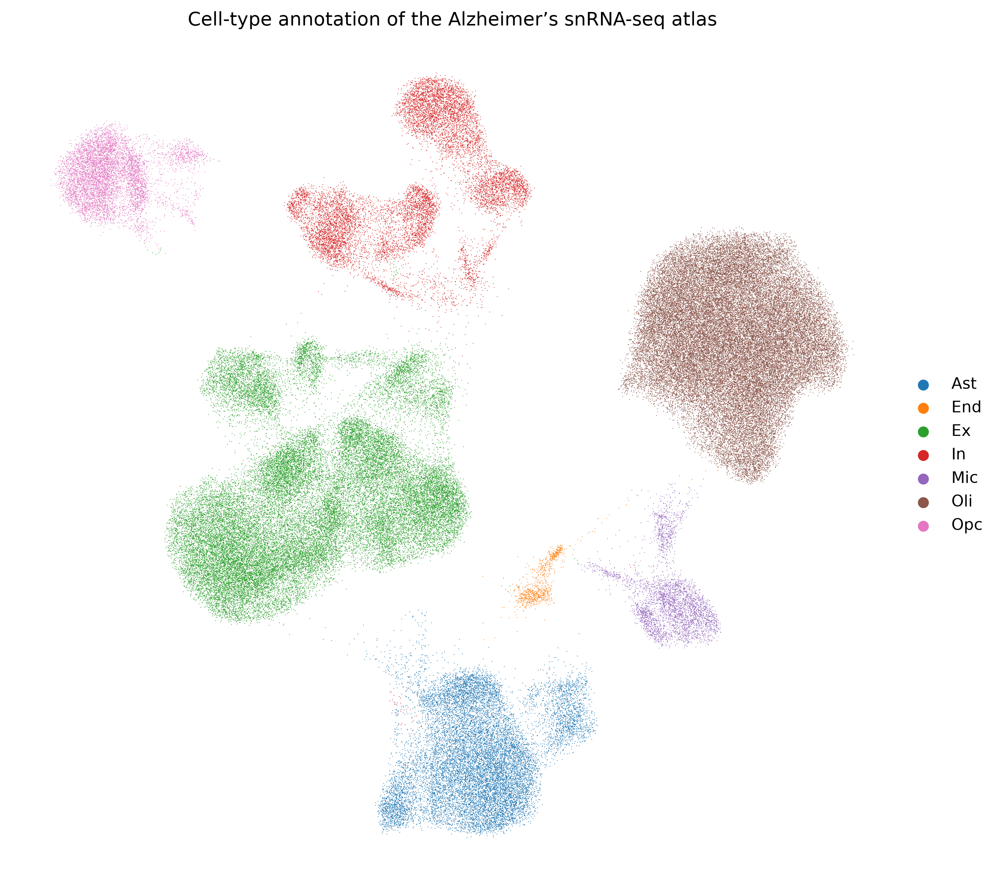
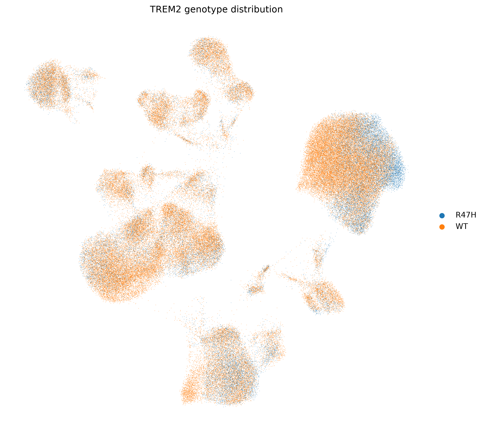
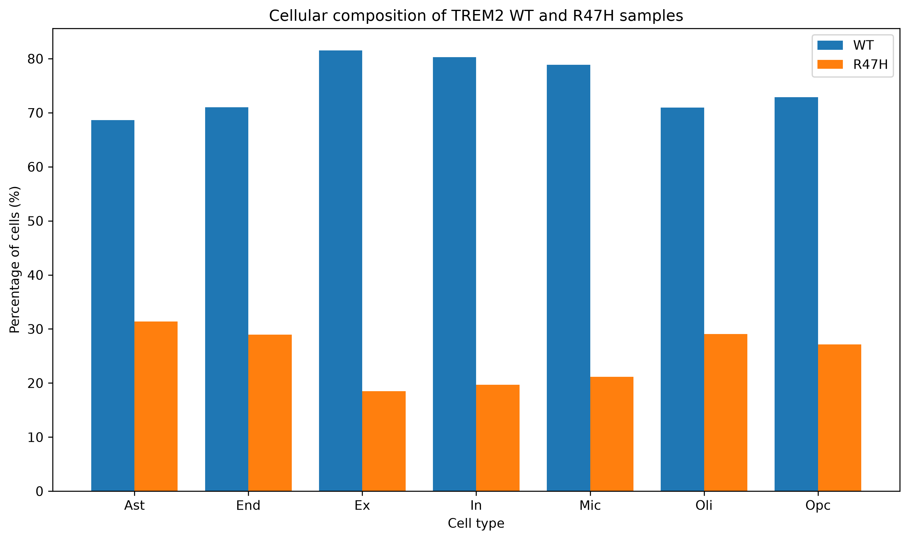
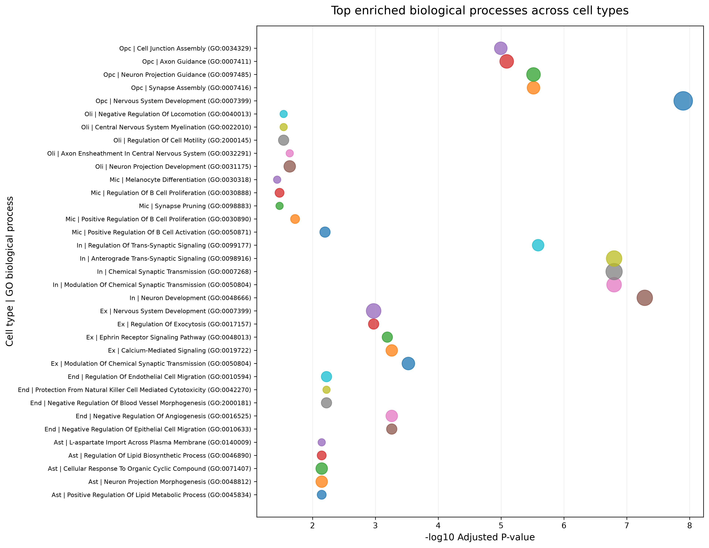
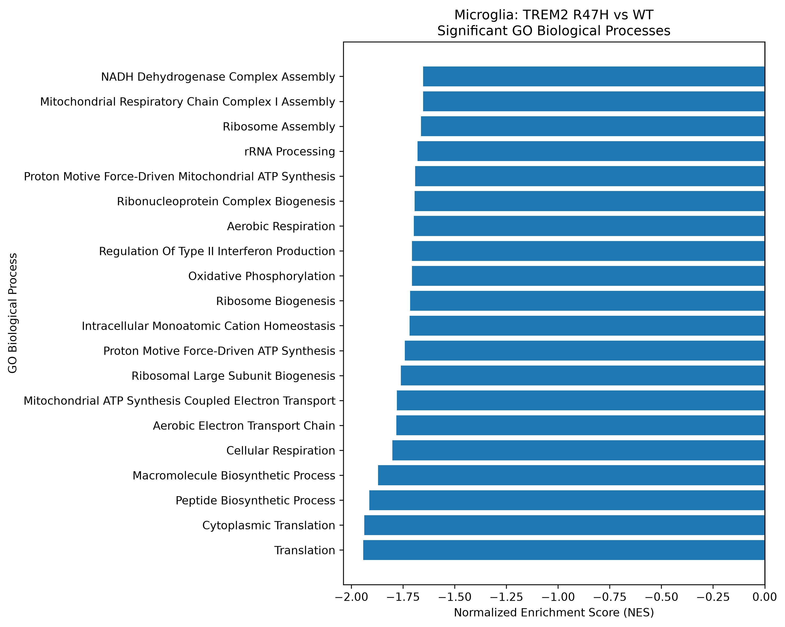
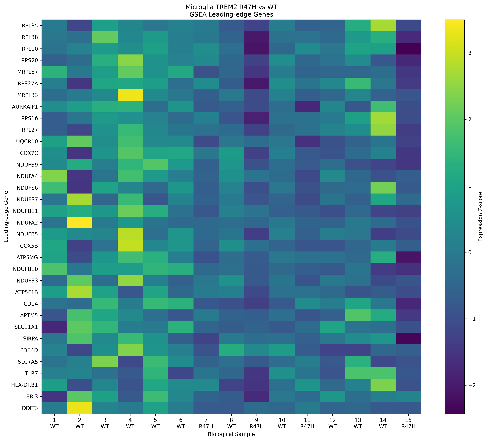

# TREM2 R47H Single-Cell Alzheimer's Disease Atlas

## Overview

This project investigates cellular and functional changes associated with the TREM2 R47H variant in an Alzheimer's disease single-cell RNA-seq dataset.

The analysis was performed using single-cell transcriptomic data to:

- Explore the cellular composition of the dataset
- Annotate major brain cell populations
- Compare TREM2 R47H and wild-type (WT) genotypes
- Identify cell-type-specific molecular changes
- Perform Gene Ontology (GO) enrichment analysis
- Perform ranked-gene Gene Set Enrichment Analysis (GSEA)
- Integrate cell-type and pathway-level findings into a biological interpretation## Dataset

**Dataset:** GSE243292

**Input:** Single-cell RNA-seq dataset in `.h5ad` format

The original large `.h5ad` dataset is not included in this repository because of its size. The analysis outputs and workflow are provided instead.

## Dataset Overview

- **Total cells:** 122,603
- **Genes:** 26,423
- **WT cells:** 92,324
- **TREM2 R47H cells:** 30,279

### Cell Types Identified

- Astrocytes (Ast)
- Endothelial cells (End)
- Excitatory neurons (Ex)
- Inhibitory neurons (In)
- Microglia (Mic)
- Oligodendrocytes (Oli)
- Oligodendrocyte precursor cells (Opc)## Analysis Workflow

```text
Raw scRNA-seq dataset
        ↓
Data exploration & quality assessment
        ↓
Cell-type annotation
        ↓
UMAP visualization
        ↓
TREM2 genotype characterization
        ↓
R47H vs WT comparison
        ↓
Cell-type-specific analysis
        ↓
GO enrichment
        ↓
Ranked-gene GSEA
        ↓
Biological integration
**Important:** this block contains an inner code block. When you paste it, make sure the three backticks around `text` and the final three backticks are preserved exactly.

---

## BLOCK 4 — COMPUTATIONAL METHODS

```markdown
## Computational Methods

The analysis was performed using a Python-based single-cell RNA-seq workflow.

### Main Steps

- Dataset exploration and quality assessment
- Cell-type annotation using established marker genes
- UMAP visualization
- TREM2 genotype characterization
- R47H vs WT comparison
- Cell-type-specific analysis
- Gene Ontology (GO) enrichment
- Ranked-gene Gene Set Enrichment Analysis (GSEA)
- Biological integration of cell-type and pathway-level results

### Tools

- Python
- Scanpy
- Pandas
- NumPy
- Matplotlib
- GSEApy
- Jupyter Notebook
- Git / GitHub## Key Results

### Cell-Type Annotation

The dataset contained seven major cell populations:

- Astrocytes
- Endothelial cells
- Excitatory neurons
- Inhibitory neurons
- Microglia
- Oligodendrocytes
- Oligodendrocyte precursor cells

### TREM2 Genotype

The dataset contained:

- 92,324 WT cells
- 30,279 R47H cells

The TREM2 genotype distribution was examined across the identified cell populations.

### Functional Enrichment

GO enrichment analysis was performed to identify biological processes associated with cell-type-specific transcriptional patterns.

### Microglia GSEA

Ranked-gene GSEA in microglia identified prominent pathways involving:

- Translation
- Cytoplasmic translation
- Peptide biosynthetic processes
- Macromolecule biosynthetic processes
- Ribosome biogenesis
- Cellular respiration
- Oxidative phosphorylation
- Mitochondrial ATP synthesis
- Mitochondrial respiratory chain processes## Key Visualizations

### Cell-Type Annotation

UMAP visualization of the major cell populations identified in the dataset.



### TREM2 Genotype

UMAP visualization showing the distribution of TREM2 WT and R47H cells.



### Cell-Type Composition

Comparison of cell-type composition between WT and R47H groups.



### GO Enrichment

Functional enrichment analysis across the annotated cell populations.



### Microglia GSEA

Pathway-level analysis of ranked microglial gene expression.



### GSEA Leading-Edge Analysis

Leading-edge genes associated with enriched microglial pathways.

## Results and Outputs

The repository contains processed results and visualizations generated during the analysis, including:

- Cell-type annotation results
- TREM2 genotype visualization
- WT vs R47H cell-type composition analysis
- Cell-type-specific differential expression results
- Gene Ontology enrichment results
- Microglia ranked-gene GSEA results
- GSEA summary visualizations
- Leading-edge gene analysis
- Integrated biological interpretation tables## Repository Structure

```text
TREM2-R47H-Alzheimers-scRNAseq/
│
├── notebooks/
│   ├── 01_data_exploration.ipynb
│   ├── figures/
│   └── results/
│
├── results/
│   └── final_results/
│
├── requirements.txt
├── .gitignore
└── README.md
Again, this block contains a nested code block, so preserve the backticks exactly.

---

## BLOCK 9 — LIMITATIONS

```markdown
## Limitations

- This analysis uses an existing single-cell RNA-seq dataset.
- The original large `.h5ad` expression matrix is not included in this repository because of its size.
- The WT and TREM2 R47H groups contain unequal numbers of cells (92,324 WT vs 30,279 R47H).
- Conventional differential expression produced a limited number of statistically significant genes after multiple-testing correction.
- Ranked-gene pathway analysis was therefore used to investigate coordinated transcriptional patterns.
- Pathway enrichment represents association with the observed transcriptional profile and does not establish causality between the TREM2 R47H variant and the identified biological processes.
- The findings are exploratory and require validation using independent datasets and/or experimental approaches.## Reproducibility

The repository contains the main analysis notebook, processed results, visualizations, and pathway-level outputs used for biological interpretation.

The original `.h5ad` dataset is excluded because of its file size.

The computational environment and major Python dependencies are documented in `requirements.txt`.## Dataset Source

The dataset analyzed in this project is publicly available through the NCBI Gene Expression Omnibus (GEO) under accession **GSE243292**.## Author

**Devansh Gahlot**

B.Tech Biotechnology  
Birla Institute of Technology, Mesra

## Project Focus

**Single-cell transcriptomics | Alzheimer's disease | TREM2 R47H | Computational biology | Functional genomics | Pathway analysis**